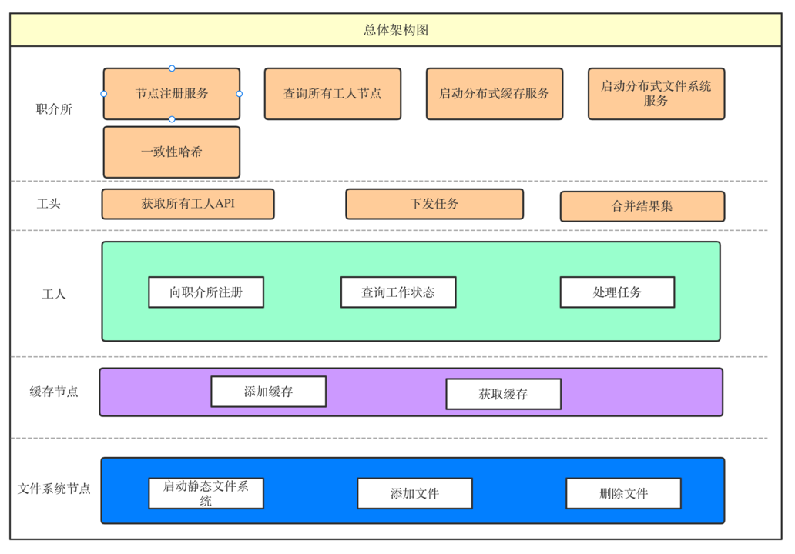
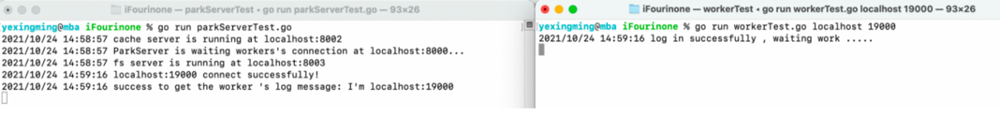
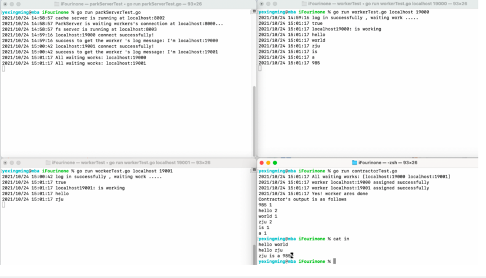
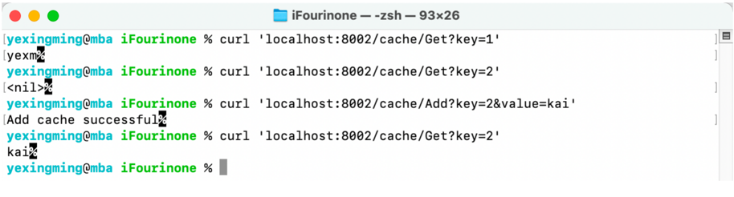
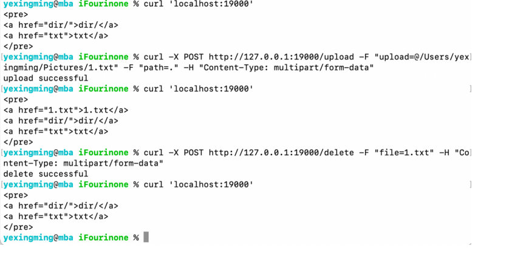

# iFourinone
A simple distributed system, based on Fourinone 2.0

## Some ports
- 8000 : listen to register for workers
- 8001 : listen to hire workers 
- 8002 : server for cache
- 8003 : fs server

## How to run the demo?
### Distribute calculate
- go run parkServerTest.go
- go run workTest.go IP PORT
> you can run one or more workTest.go
- go run contractorTest.go

### Distribute cache
- go run parkServerTest.go
- go run cacheNodeTest.go ip port maxbytes_for_cache
> you can run one or more cacheNodeTest.go

### Distribute fileSystem
- go run parkServerTest.go
- go run FSNodeTest.go localhost 19000 /Users/yexingming/code/go/iFourinone/123
- go run FSNodeTest.go localhost 19001 /Users/yexingming/code/go/iFourinone/456
> you can run one or more FSNodeTest.go
>
> the function of uploading and deleting file can only use command
```shell
# upload commands:
curl -X POST http://127.0.0.1:19005/upload -F "upload=@/Users/yexingming/Pictures/1.txt" -F "path=dir" -H "Content-Type: multipart/form-data"
curl -X POST http://127.0.0.1:19005/upload -F "upload=@/Users/yexingming/Pictures/1.txt" -F "path=." -H "Content-Type: multipart/form-data"

# delete commands:
curl -X POST http://127.0.0.1:19005/delete -F "file=dir/1.txt" -H "Content-Type: multipart/form-data"
curl -X POST http://127.0.0.1:19005/delete -F "file=1.txt" -H "Content-Type: multipart/form-data"
```

## Screenshot







## Notice
- 供远程RPC调用的方法首字母需要大写，大写表示允许外部访问
- RPC方法若需要返回值最后需要对*reply赋值，而不是对reply赋值
- 方法声明的reply类型最好和传入的reply类型保持一致
